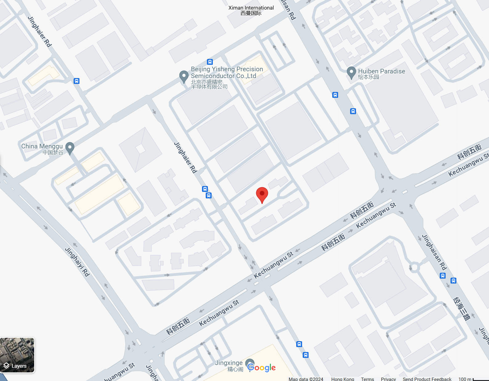
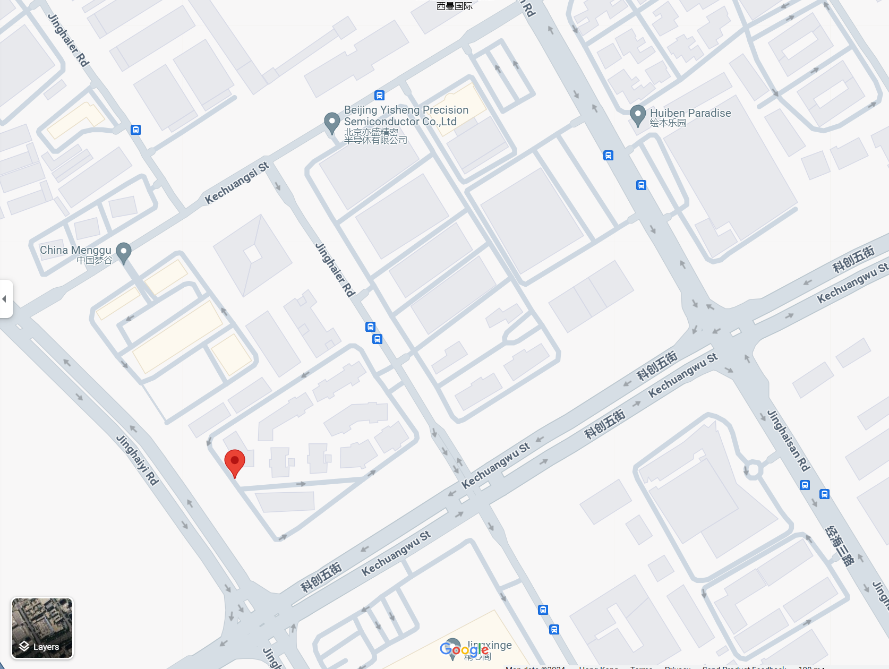
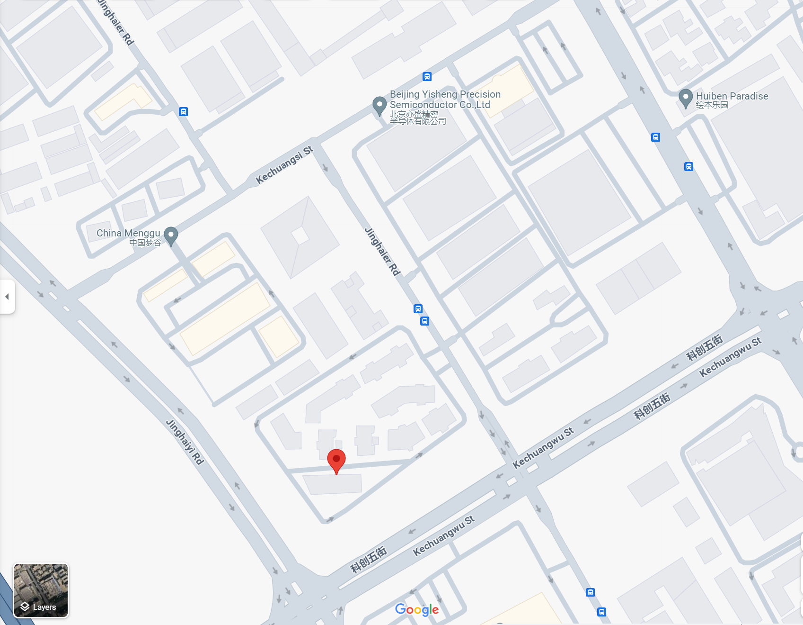

## 数据集的UTM坐标在谷歌地图上的大致位置
#### 10030  #1 
utm坐标：[Agent?]
419768.550283468,4732788.81232562

#
#### 10030.csv   #105 
utm坐标：[Agent]
419506.758438257,4732655.18083206

#
#### 10035.csv   #4
utm坐标：[BUS]
419565.516073153,4732639.52270707

